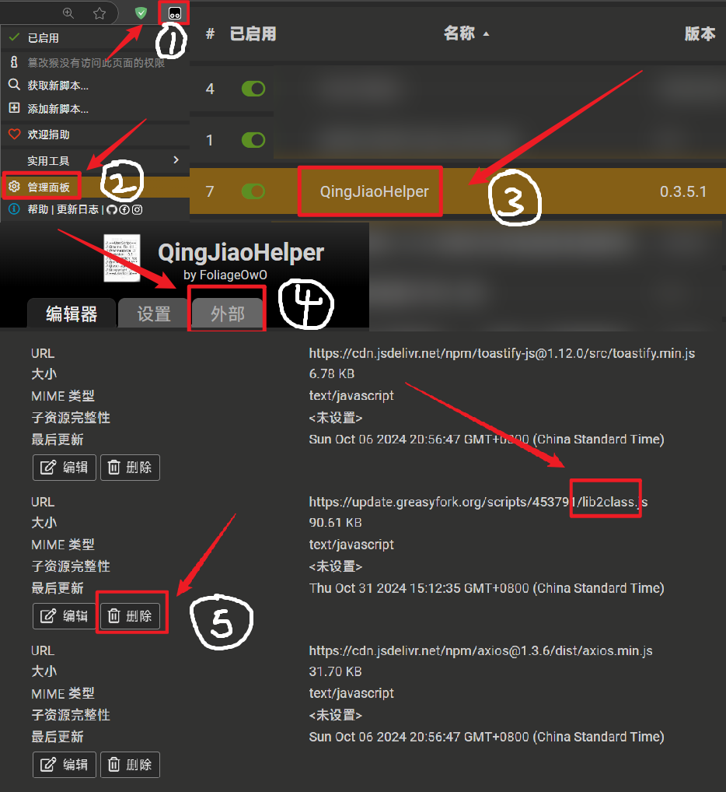

# QingJiaoHelper

青骄第二课堂小助手: 2024 知识竞赛 | 跳过视频 | 自动完成所有课程 | 领取每日学分 | 课程自动填充答案

**24/10/31：已支持所有年级的知识竞赛和期末考试，你可能需要清除缓存来更新到最新的题库（清除教程在下面的常见问题解答中）。由于青骄第二课堂最近更新了验证，目前单个课程完成暂时无法使用**

**！！有问题请先看下面的常见问题解答！！**

**欢迎提供期末考试和知识竞赛题库**，联系邮箱 `mc.windleaf@foxmail.com` 或以 [Github](https://github.com/FoliageOwO) 注明的联系方式联系我。

## 免责声明

1. **该项目仅用于个人学习交流，禁止用于商业及非法用途，项目开发者对由脚本产生的任何性质的问题或纠纷概不负责！**
2. **该项目没有违反任何脚本规则，举报前请仔细阅读源码，阅读授权！不要闲着没事乱举报脚本，维护脚本不容易！**

## 支持与反馈

**如果觉得此脚本帮到了你，欢迎在 `Github` 上为我点颗星星，或者在 [我的 Github 主页](https://github.com/FoliageOwO) 中的赞赏码来赞助我，谢谢！**

- [Github 仓库](https://github.com/FoliageOwO/QingJiaoHelper/)
- [赞赏列表](https://github.com/FoliageOwO/QingJiaoHelper/blob/master/FUNDERS.md)

## 使用方法

1. 安装这个脚本
2. 打开青骄第二课堂并使用（见下面 **使用方法**）

## 激活方法

**注意：大部分功能默认都是关闭状态，你可以自定义开关对应功能（点击油猴脚本图标 → QingJiaoHelper → 菜单 → 功能名前的开关），关闭后将会无法激活**

- ① 跳转到页面来激活对应功能
  - https://www.2-class.com/courses - 自动完成所有选择年级的课程（不包括期末考试）（推荐和 `自动开始作答、下一题和提交` 配合使用）
  - ~~https://www.2-class.com/selfCourse - 自动完成所有**自学**课程（不包括考试）~~（暂不支持全自动完成）
  - https://www.2-class.com/admin/creditCenter - 自动点赞资源来获取学分，包括 `心理减压`、`耕读学堂`、`校园安全` 等等，但只会点赞部分资源，只保证学分中心中 `领取禁毒学子勋章` 和 `完成任意两次点赞` 完成
  - https://www.2-class.com/courses/exams/finalExam - 期末考试（无法保证全对，准确性取决于题库，推荐和 `自动下一题并提交` 功能搭配使用）（仅部分地区的期末考试可以免做，其他地区的期末考试由于缺少题库暂时没办法做）
  - https://www.2-class.com/competition - 知识竞赛（无法保证全对，准确性取决于题库，推荐和 `自动下一题并提交` 功能搭配使用）
- ② 在菜单中一键完成
  - 点击油猴脚本图标 → QingJiaoHelper → 菜单 → 一键完成
- ③ 手动完成课程
  - 进入单个课程考试页面（如 https://www.2-class.com/courses/exams/1309）
  - 点击开始答题，之后每一题都会自动选择，并在左上角显示答案
  - **注意：如果 `自动下一题并提交` 功能未开启，`下一题` 的按钮是要手动按的，而且不要点太快，否则可能无法自动填充答案。如果出现答案未填充的情况，请刷新页面**
- ④ 课程视频跳过
  - 进入进入单个课程视频页面（如 https://www.2-class.com/courses/1824）
  - 请手动点击视频的播放按钮，将会自动跳转到最后，如果没有跳转请再点击试试
  - **注意：目前无法做到直接跳过视频，否则会无法被判定为学习完成，即没有学分**

## 常见问题解答

- **是否支持批量导入账号并批量完成**

目前版本还未实现，由于青骄第二课堂更新了 `nvc` 无痕验证 (具体见 [阿里云验证码功能概述](https://help.aliyun.com/document_detail/122071.html))

经过测试，插件和脚本并不能完成自动填充并登录。如果需要此功能，请使用 `Python`、录制宏之类的工具软件辅助本脚本

本人精力有限，这个问题就先放在这里，还望大佬提供更好的解决方案

- **题库已更新，但我没收到最新题库，我该怎么更新**

1. 点击浏览器油猴脚本的图标，点击 **管理面板**
2. 在出现的脚本列表中，点击 `QingJiaoHelper`
3. 点击 **外部**
4. 找到带有 `lib2class` 字样，点击 **删除**
5. 重新打开青骄第二课堂网页即可

图示教程：

- **脚本出问题不工作了怎么办**

1. 先检查是不是最新版本，如果不是请先更新
2. 跳转到出问题的页面，按下 `F12` 或右键页面选择 `检查` 来打开 **开发者工具**
3. 切换到 `控制台`（英文是 `Console`）选项卡
4. 除了 `Failed to load resource` 开头的错误，查看有没有别的红色的消息（一般都是中文错误）
5. 截图控制台错误，在 `GreasyFork` 反馈，或者 `GitHub Issues` 反馈，并带上截图

## 特别感谢

- [HF0920](https://greasyfork.org/zh-CN/users/971958-hf0920) - 提供账号测试
- [GooGuJiang](https://github.com/GooGuJiang) - 更换脚本外部库 CDN、UI 改进
- [wyhh54321](https://greasyfork.org/zh-CN/users/973982-wyhh54321) - 提供官方题库
- [飞小 RAN](https://github.com/xiaofeiTM233) - 提供账号测试
- [hmjz100](https://github.com/hmjz100) - 提供知识竞赛代码实现
- Tzimorotas - 提供账号测试、2023 年五年级到高二期末考试题库、2024 年小学和中学知识竞赛题库
- forlxh - 提供 2024 六年级、初一、初二、高一、高二、中职一、中职二期末考试题库

## 版权

本脚本使用了以下开源库，它们的名字与开源许可如下：

- [toastify-js](https://github.com/apvarun/toastify-js) - Pure JavaScript library for better notification messages - MIT
- [axios](https://github.com/axios/axios) - Promise based HTTP client for the browser and node.js - MIT
- [spectre](https://github.com/picturepan2/spectre) - A Lightweight, Responsive and Modern CSS Framework（经修改，修改后的版本在本脚本仓库下） - MIT
